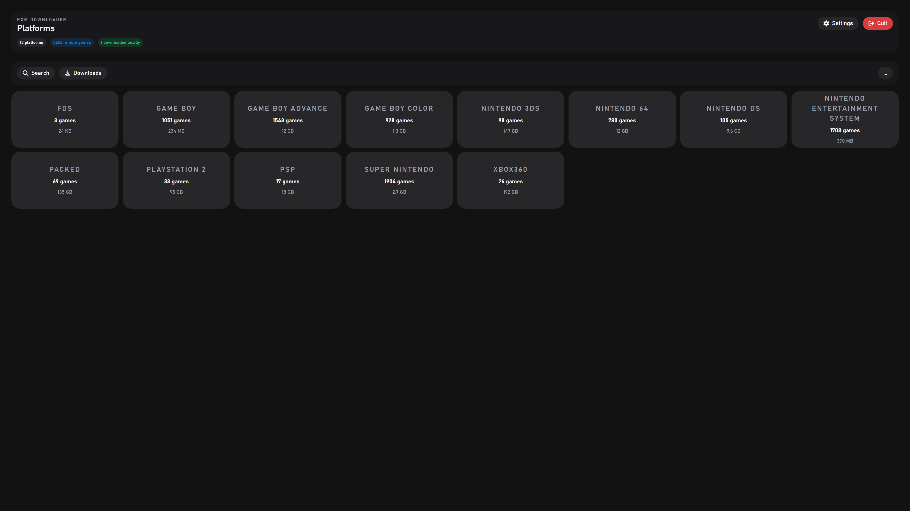
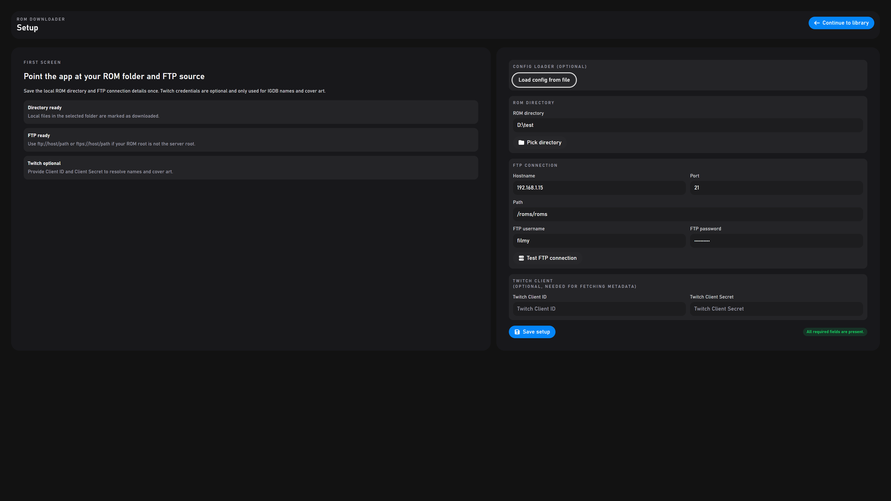
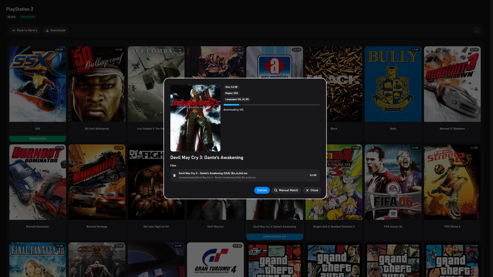
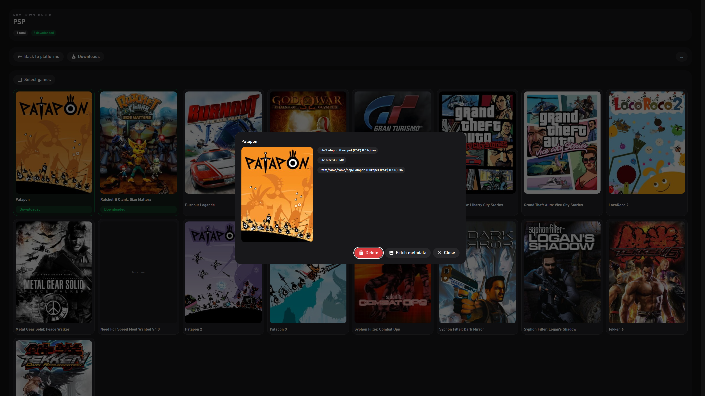

 
 
 
 

# Romloader Desktop

Romloader Desktop is an Electron-based app for browsing, managing, and downloading retro game files from remote services into your local library. Designed for HTPCs, handheld PCs, and desktop setups, it features full gamepad navigation and a modern UI.

## Features

- **Multi-service remote connection support:**
  - FTP
  - SFTP
  - Nextcloud (WebDAV)
  - RomM API
- **Flexible connection setup:**
  - Service type selection
  - Hostname + port
  - Protocol selection (HTTP/HTTPS) for web-based services
  - RomM API token authentication
- **Library browsing:**
  - Platform-level navigation
  - Search
  - Downloaded-only filtering
- **Download management:**
  - Per-game and multi-select downloads
  - Queue-based download
  - Progress tracking
- **Metadata support:**
  - IGDB integration for game metadata
  - Cover artwork display in library views
- **Local storage support:**
  - Customizable local ROMs folder
  - App storage default path
- **Gamepad-first UI:**
  - Navigate the entire app with a gamepad or keyboard (no mouse required)

## RomM Support

Romloader Desktop can connect directly to RomM using:

- Protocol: HTTP or HTTPS
- Hostname/IP
- Port
- API Token

RomM is treated as an API-backed provider (not a raw filesystem), so the app maps RomM platforms and ROM files into browsable library entries.

## Getting Started

0. **IMPORTANT** For FTP, SFTP, and Nextcloud sources, name your platform folders using one of the aliases listed in the platform table below.
1. Download and launch Romloader Desktop.
2. Complete onboarding:
   - Configure remote service connection
   - Configure optional IGDB credentials
3. Open the library and browse platforms/games.
4. Select games and start downloads.

## Platform Folder Naming (FTP/SFTP/Nextcloud)

When using filesystem-based services (FTP, SFTP, Nextcloud), Romloader Desktop maps folder names to known platforms using aliases.
Use one of the aliases below as your folder name.

| Platform                      | Accepted folder names (aliases)                    |
| ----------------------------- | -------------------------------------------------- |
| PlayStation                   | ps1, psx, playstation, sonyplaystation             |
| PlayStation 2                 | ps2, playstation2, sonyplaystation2                |
| PlayStation 3                 | ps3, playstation3, sonyplaystation3                |
| PlayStation 4                 | ps4, playstation4, sonyplaystation4                |
| PlayStation 5                 | ps5, playstation5, sonyplaystation5                |
| PSP                           | psp, playstationportable                           |
| PS Vita                       | psvita, vita, playstationvita                      |
| Nintendo Entertainment System | nes, nintendoentertainmentsystem                   |
| Super Nintendo                | snes, supernintendo, superfamicom                  |
| Nintendo 64                   | n64, nintendo64                                    |
| Game Boy                      | gb, gameboy                                        |
| Game Boy Color                | gbc, gameboycolor                                  |
| Game Boy Advance              | gba, gameboyadvance                                |
| Nintendo DS                   | ds, nds, nintendods                                |
| Nintendo 3DS                  | 3ds, n3ds, nintendo3ds                             |
| Nintendo GameCube             | gamecube, gc, ngc                                  |
| Nintendo Wii                  | wii                                                |
| Nintendo Wii U                | wiiu, nintendowiiu                                 |
| Nintendo Switch               | switch, nintendoswitch, nsw                        |
| Sega Genesis                  | genesis, megadrive, segagenesis, segamegadrive, md |
| Sega CD                       | segacd, megacd                                     |
| Sega Saturn                   | saturn, segasaturn                                 |
| Dreamcast                     | dreamcast, segadreamcast, dc                       |
